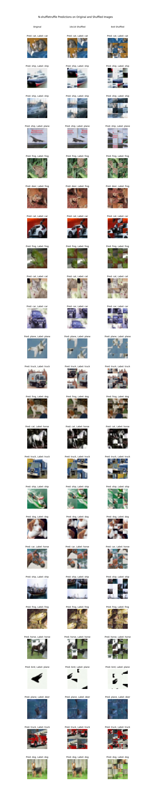

# Assignment 2 Report

In this assignment, we report our results on developing `Plain-Old-CIFAR10`, `D-shuffletruffle`, and `N-shuffletruffle`
models.

**Plain-Old-CIFAR10:** This model is developed with the goal of achieving the highest unshuffled accuracy possible.
Achieving similar accuracy with the shuffled datasets is not considered.

**D-shuffletruffle:** This model is developed with the goal of achieving similar accuracy between unshuffled and `16x16`
shuffle datasets while having an acceptable accuracy.

**N-shuffletruffle:** This model is developed with the goal of achieving similar accuracy between unshuffled and `8x8`
shuffle datasets while having an acceptable accuracy.

## Training

We also heavily modified the default train cycle. We implement better logging and also implement decreasing learning
weight and early stopping for faster and more precise training. 

We employ 3 main data augmentation steps:
- Random Vertical Flip
- Random Horizontal Flip
- ColorJitter


## How to Run

### Running Training Code
This code will run the training cycle code for the given model class.

```sh
python main.py --epochs 10 --model_class 'Plain-Old-CIFAR10' - -batch_size 128 - -learning_rate 0.01 - -l2_regularization 0.0001
```

## Options

- epochs (int): Number of epochs for training (default: 100).
- model_class (str): Model class name. Choices - 'Plain-Old-CIFAR10','D-shuffletruffle','N-shuffletruffle'. (default: '
  Plain-Old-CIFAR10')
- batch_size (int): Batch size for training (default: 100).
- learning_rate (float): Learning rate for the optimizer (default: 0.004).
- l2_regularization (float): L2 regularization strength (default: 0.0).

### Running Evaluation
This code will execute the evaluation for the specified model class. It will generate the evaluation results and figures 
in the results section of this report.

```sh
python eval.py <model-class>
```
- model_class (str): Model class name. Choices - 'Plain-Old-CIFAR10','D-shuffletruffle','N-shuffletruffle'. (default: '
  Plain-Old-CIFAR10')


## Architectures

In this section we will briefly explain the architectures employed in our experimentation

### ShuffleViT

ShuffleViT is a specialized architecture designed for D-shuffletruffle and N-shuffletruffle tasks. It's based on the
classical ViT architecture. In this modified architecture, instead of processing the entire image as is, we first split
the image into different patches and process every patch independently using the transformer module in a random order.
This way, we achieve shuffle invariance.

### Resnet50

For this dataset we observed that CNN-based models worekd better than transformer-based models. So for the
Plain-Old-CIFAR10 task, we employed Resnet50 architecture.

## Results

In this section, we will present the performance of our models. We also provide PCA analysis and present 12 samples from
the test dataset, including every variant of the sampled images for each best performing model.

### Test Loss

| Model Class       | Architecture | Unshuffled | 16x16 Shuffle | 8x8 Shuffle |
|-------------------|--------------|------------|---------------|-------------|
| Plain-Old-CIFAR10 | Resnet50     | 0.78       | 2.38          | 2.89        |
| D-shuffletruffle  | ShuffleViT   | 1.14       | 1.14          | 1.47        |
| N-shuffletruffle  | ShuffleViT   | 1.27       | 1.27          | 1.27        |

### Test Accuracy

| Model Class       | Architecture | Unshuffled | 16x16 Shuffle | 8x8 Shuffle |
|-------------------|--------------|------------|---------------|-------------|
| Plain-Old-CIFAR10 | Resnet50     | 74.70      | 36.33         | 26.41       |
| D-shuffletruffle  | ShuffleViT   | 59.77      | 59.7          | 48.34       |
| N-shuffletruffle  | ShuffleViT   | 54.720     | 54.63         | 54.68       |

### PCA Analysis

#### Plain-Old-CIFAR10


#### D-shuffletruffle


#### N-shuffletruffle


### Sample Analysis

#### Plain-Old-CIFAR10


#### D-shuffletruffle


#### N-shuffletruffle


## Contributions
- **meocakir:** Implemented the training cycle (early stopping, decreasing learning rate and better logging). Implemented evaluation code (including figures). Implemented and experimented with ShuffleViT architecture. Experimented with Resnet architecture to achieve high accuracy. 
- **jagakovi:** ...
- **agajulap:** ...